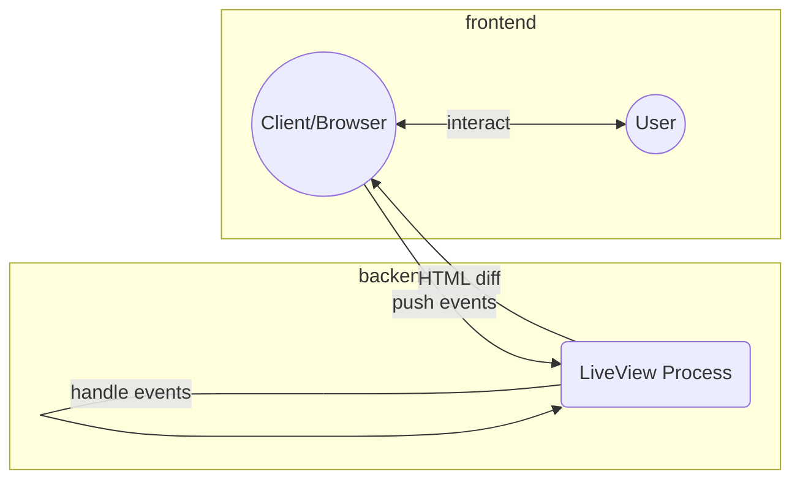

<div class="centered" markdown="1">
  <h1>Phoenix Live View - SPA bez JS</h1>
  <h2>Nikola Begedin</h2>
  <h3 style="display: grid; grid-template-columns: 1fr auto 1fr; gap: 0.25em;">
    <span style="text-align: right;">Bego Solutions</span>|<a>bego.fly.dev</a>
    <span style="text-align: right;">V7</span>|<a>v7labs.com</a><br/>
  </h3>
</div>
Note:

Pozdrav svima.
Ja sam Nikola i imam d.o.o. jer su obrti postali riskantni :)

Posljednjih 7 godina radim s Elixir backendom, a posljednjih 5 s Vue.js na frontendu.

Ovo predavanje će u fokusu imati jedan manji dio jednog web frameworka u elixiru.
---

# Što je phoenix live view

- library za "html over the wire" (websockets)
  - phoenix framework
    - elixir 
      - erlang

Note: 

Library za takozvani html preko žice. 
Radi na podlozi od phoenix frameworka, koji je web framework za elixir jezik, koji je funkcijski jezik povrh erlang funkcijskog jezika. 

Ovo je prva weblica gdje nisam jedini elixir developer, tako da sam siguran da će vam moć erlagna i elixira jako dobro demonstrirati Andrei u svojem predavanju danas posljepodne.

---

# Što je što?

## erlang
  - funkcijski jezik
  - Erricson, 1986
  - OTP (open telecom platform)
  - VM
  - Joe Armstrong, Robert Virding, Mike Williams

```erlang
-module(series).
-export([fib/1]).
%% public
fib(0) -> 0;
fib(N) when N < 0 -> err_neg_val;
fib(N) when N < 3 -> 1;
fib(N) -> fib_int(N, 0, 1).
%% private
fib_int(1, _, B) -> B;
fib_int(N, A, B) -> fib_int(N-1, B, A+B).
```
Note: Al idemo ipak na brzinu reći što je to.
Erlang je funkcijki jezik razvijen pod podrškom ericsona, namijenjen za telekom platforme. Ideja je bila osmislit jezik koji je robustan, otporan na rušenja i jako dobar za razne oblike concurrencya. U tome su uspjeli i ovako otprilike izgleda.
---

# Što je što?

## Elixir

- funkcijski jezik napisan u Erlangu + Elixiru
- Jose Valim
- svi benefiti
- ugodniji ux

```elixir xs
defmodule Series do
  def fib(0), do: 0
  def fib(n) when n < 0, do: raise "Cannot pass negative value"
  def fib(n) when n < 3, do: 1
  def fib(n) do
    fib(n, 0, 1)
  end

  defp fib(1, _, b), do: b
  defp fib(n, a, b), do: fib(n-1, b, a+b)
end
```
Note: 

Elixir je isto funkcijski jezik, s ruby-like sintaksom, napisan u erlangu i elixiru. Znači, malo smo rekurzivni.

Ovako izgleda i ima jako puno jako dobrih stvari.
---
# Što je što?

## Phoenix framework

- THE web framework u elixiru
- Chris McCord
- html.eex templating jezik
- podrška za komponente


<div class="code-multi-part">

```elixir xs multipart
## fib_controller.ex
def fib(conn, %{"n" => n}) do
  result = Series.fib(n)
  render(conn, :fib, %{n: n, result: result})
end

## fib_html.ex
attr(:n, :integer, required: true)
attr(:result, :integer, required: true)
def fib(assigns) do
  ~H"""
```
```html xs multipart
  <UI.card>
    <p data-n={n} data-result={result}>
      The <%= n %>th fibonacci number is <%= result %>
    </p>
  </UI.card>
  """
```
```elixir xs multipart
end
```
</div>
Note: 

Phoenix je glavni web framework u elixiru.

Može sve što može tipični mvc framework, ali isto zahvaljujući podlozi jako dobro radi stvari tipa websocket konekcije, pub sub, clustering, bilo kakov multi-process ponašanje, itd. Ima jako malo overheada tako da je i jako jako brz.
---
# Što je što

## Phoenix live view

- dodatak na Phoenix Framework
- html preko žice

Note: 

Phoenix live view uzima web sockete i s njima radi nešto magično. 
---
# Kako izgleda?

<div class="code-multi-part">

```elixir xs multipart
# items_live.ex
def mount(_params, _session, socket) do
  items = Repo.all(Item)
  socket = assign(socket, :items, items)
  {:ok, socket}
end

def render(assigns) do
  ~H"""
```

```html xs multipart
  <ul>
    <li :for={item <- @items}>
      <UI.row_layout>
        <a href={~p/items/#{item.id}}><%= item.text %></a>
        <button phx-click="delete" phx-value-id={item.id}>X</button>
      </UI.row_layout>
    </li>
  </ul>
```

```elixir xs multipart
  """
```
```elixir xs multipart
end

def handle_event("delete", %{"id" => item_id}, socket) do
  Repo.delete!(Item, id)
  items = Enum.reject(socket.assigns.items, & &1.id === id)
  socket = assign(socket, :items, items)
  {:noreply, socket}
end
```
</div>

Note: 

Pa evo primjera. Ovdje vidimo kod za interaktivnu listu "todova", gdje svaki ima tipku X, ciji klik uklanja todo sa stranice bez bilo kakvog refresha i s nulla js koda s naše strane.

Znači, imamo html koji renderiramo, imamo binding na user interakciju koja šalje nešto na backend, i imamo handlanje događaja kojeg trigerira ta interakcija. Sve bez js-a kojeg mi moramo pisati.
---
# Kako funkcionira?



Note: 
Live view modul je proces na beamu. To nije isto kao i process na operacijskom sustavu, nego nešto puno lakše i jednostavnije.

Process ima svoje stanje i red poruka koje mu se šalju.

Render funkcija generira nešto što na kraju postane html i to se pokaže korisniku. Dodatno se hidrira event bindinzima ovisno o attributima dodijelenim html elementima.

Uspostavi se websocket konekcija između klijenta i live view processa na backendu. 

Ovisno o tome što korisnik radi, okidaju se događaji koji šalju poruke procesu na backendu. To bi bila handle_event funkcija.

Process hendla poruke i ovisno o njima radi nešto, tipa osvježava state ili radi nešto s bsuness layerom pa onda osvježava state, itd.

Sve to uzrokuje da se dijelovi html-a koji se trebaju regenerirati, regeneriraju. Taj diff se onda preko iste ws konekcije šalje na FE i updatea u domu.

I tako u krug?

---

# Zašto?

- JSON/Protobuf/Whatever API je nepotreban

Note:

Čemu sve to?
Pojednostavni se i znatno smanji onaj slok koji obićno imamo kad je backend samo API, a frontend je SPA. Nema renderiranja JSON-a koji se onda koristi da bi se na klijentu renderirao HTML.

Umjesto toga imamo puno tanji sloj koji skori direktni komunicira s BL-om.
---

# DEMO: Live Beats

- https://livebeats.fly.dev/begedin
- https://github.com/fly-apps/live_beats

Note: 

Al ajdemo na primjer ili dva.

Ovaj prvi je službeni primjer librarya. Link pokazuje na moj profil. Ako se spojite, možete se poigrati malo.

Efektivno, ovo je kolaborativni mp3 player. Reprodukcija je na frontendu, ali svije dijelimo stanje - što se svira, koji je progress, itd.

---

# DEMO: Zmija

- https://livepixel.fly.dev<br/>
- https://github.com/begedin/livePixel

Note: 

Ovaj drugi je moja radinost. 
Htio sam vidjeti koliko js-a treba za jednostavnu igru zmije. Ispada da ne baš puno, i iskreno, i to što ima bi se dalo smanjiti kad bi, recimo, umjesto pixi-a direktno renderirali svg, što možemo.

---

# Problemi?

## Latencija

- svaka interakcija je ws roundtrip
- riješenje: ipak malo JS-a

## Lako pogriješiti

- greške u sigurnosti 
- nepotrebno loše performanse

Note: 

Glavni problem je latencija. Ova stvar funkcionira odlično kad je server na istom kontinentu, idealno na istoj polovici kontinenta.

Kad idemo preko pola zemaljske kugle, onda imamo problem.

Drugi problem je da ljudi često previde neke sigurnosne probleme. Stvari funkcioniraju drukčije, pa postoji potencijal za netipične greške

---

# Ipak malo JS-a

## Phoenix.LiveView.JS

```elixir
alias Phoenix.LiveView.JS

def hide_modal(js \\ %JS{}) do
  js
  |> JS.hide(transition: "fade-out", to: "#modal")
  |> JS.hide(transition: "fade-out-scale", to: "#modal-content")
end
```

Razne mogucnosti

```elixir
add_class, remove_class, toggle_class, set_atribute, remove_attribute,
toggle_attribute, show, hide, toggle, transition, dispatch, push, focus
```

Sitne client-side modifikacije HTML-a bez pisanja JS-a, "ručno" slanje evenata u DOM i na server, itd.

Note:

Riješenje je ipak tu i tamo koristiti JS, kako bi se efekt latencije stvario. Recimo, otvaranje dijaloga stvarno ne bi trebalo ovisiti o backendu, osim u iznimnim situacijama.

Razni efekti i animacije isto tako.

Zato imamo modul koji omogućuje pisanje JS-a bez pisanja JS-a.

Osobno, ako developer koji jednako voli FE i BE, nisam baš lud za ovime, ali funkcionira i često zna biti korisno.

---

# Ipak malo JS-a

## Hooks

```html
<div id="infinite-scroll" phx-hook="InfiniteScroll" data-page={@page}>
```

```js
let Hooks = {}

Hooks.InfiniteScroll = {
  page() { return this.el.dataset.page },
  mounted(){
    this.pending = this.page()
    window.addEventListener("scroll", e => {
      if(this.pending == this.page() && scrollAt() > 90){
        this.pending = this.page() + 1
        this.pushEvent("load-more", {})
      }
    })
  },
  updated(){ this.pending = this.page() }
}
let liveSocket = new LiveSocket("/live", Socket, {hooks: Hooks, ...})
```

Note: 

Druga opcija je stvarno pisanje JS-a. Phoenix podržava koncept hookova. Hook je koji je objekt posebne strukture, koji se veže na dom element i živi s njim. Može reagirati na promjene doma, primati i slati evente, itd. 

Hook je način na koji sam pixi povezao s live-viewom, recimo

---

# I to je to

- fali još poneki detalj
  - html component/file references
  - dobar testing library

Note:

I to je manje više to. Live view stvarno nije puno više od ovoga što sam ovdje naveo. Ima jos jedna manja stvar ili dvije, tipa ugrađena podrška za streamanje velikih listi, upload, i sl.

Ali u osnovi, to je jedna relativno mala ali učinkovita biblioteka koja moć phoenix frameworka i elixir jezika gura u ovo područje.

---

# Još nešto

- live view native
- livebook
  - demo

Note:

Definitivno još vrijedi spomenuti livebook, koji je live view verzija nečeta kao što je jupiter notebook.

Znači code notebook s kojim se može puno toga. 

Zašto? Jer se elixir par godina gura i u AI/ML vode, pa zašto ne.
Isto tako je i u embedded computing vodama putem nerves frameworka, pa su takve stvari korisne i tamo.
---

# Još nešto

- primjeri iz stvarnog svijeta
  - Cars.com
  - intellidoc.io
  - logflare.app
  - elixirstream.dev
  - TeslaCarLot.com
  - stiched.co.uk

---
# Ovo nije ništa novo

- danas više ne

| jezik | rješenje | prva verzija |
|---|---|---|
| C# | Blazor | 2018 |
| Elixir | PhoenixLiveView | 2019 |
| PHP | Livewire | 2020 |
| Ruby on rails (i drugi) | Turbo/Hotwire | 2021 |
| React | Next.js + Server Components | 2023 ? |

- jedan od ranijih
- jako lightweight
  - elixir backend
  - ws
  - malo js "ljepila" ~4000 LOC

Note:

I za kraj, čisto da se razumijemo, kužim da ovo više nije ništa novo, ali vrijedi reći da je live view tu jedan od prvih i još uvijek jedan od najlakših i najbrćih.

---

# Prebaciti se na Elixir zbog ovoga?

- ne
- možda za osobne projekte
- moooožda za nove projekte

Note:

Ne, osim ako ste znatiželjni ili imate neki vanjski razlog. Tolko revolucionarno ipak nije.

---
<div class="centered">
  <h1>Hvala! &nbsp;  Pitanja?</h1>
  <div>@begedinnikola</div>
  <div>github.com/begedin</div>
  <div>bego.fly.dev</div>
</div>
